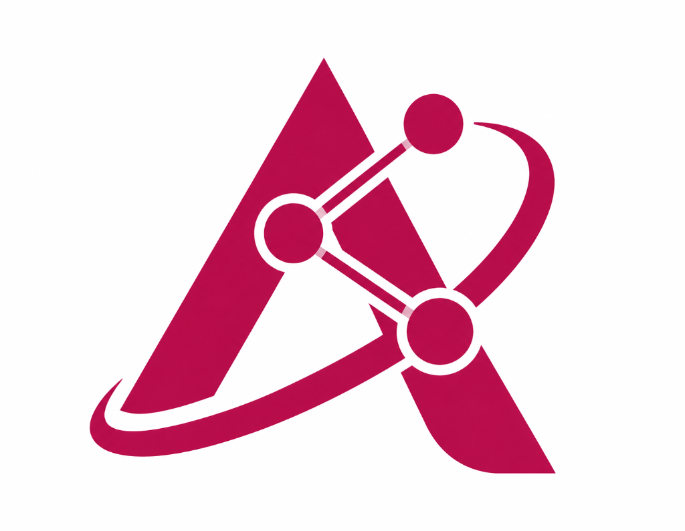

# ALeX — Amrita Lab Explorer

<div align="center">



### **Amrita Lab Explorer**
*“Explore. Discover. Connect.”*

**Amrita Vishwa Vidyapeetham — Chennai Campus**

[](https://reactjs.org/)
[](https://vitejs.dev/)
[](https://tailwindcss.com/)
[](#license)

</div>

---

## 📌 Project Purpose

**ALeX (Amrita Lab Explorer)** is a centralized digital gateway designed for students, faculty, researchers, and visitors to discover and explore research laboratories, centres of excellence, and specialized facilities at **Amrita Vishwa Vidyapeetham, Chennai Campus**.

### Primary User Flow:
```
ALeX
  ↓
Explore Research Labs
  ↓
Search / Category Filters
  ↓
Select a Laboratory
  ↓
Visit Lab (New Tab)
  ↓
Official / Intranet Lab Portal (e.g. NEGCES)
```

> **Important Note:** ALeX is a dedicated research-laboratory discovery and navigation portal. It is not an e-commerce platform nor an official replacement for the primary university website.

---

## 🔬 Research Laboratories & Centres Directory

ALeX features all 16 recognized laboratories and centres at Amrita Chennai:

| # | Laboratory Name | Acronym | Research Domain | URL Status |
|---|---|---|---|---|
| 1 | Tribology and Interactive Surface Research Laboratory | `TRISUL` | Materials | *Website link unavailable* |
| 2 | Robotics and Automation Centre of Excellence | `RACE` | Robotics & Automation | *Website link unavailable* |
| 3 | Artificial Intelligence and Data Science Innovation Center | `AIDISC` | AI & Data Science | *Website link unavailable* |
| 4 | Research Hub for Intelligent Systems and Embedded Computing | `RHISC` | Embedded Systems | *Website link unavailable* |
| 5 | Advanced Security & Testing Research Arena | `ASTRA` | Cybersecurity | *Website link unavailable* |
| 6 | Strategic Hub for Intelligent Cyber Defence | `SHIELD` | Cybersecurity | *Website link unavailable* |
| 7 | Amrita Innovation Lab | `Ai Lab` | AI & Data Science | *Website link unavailable* |
| 8 | Next Generation Computing and Experimental Systems | `NEGCES` | Computing | **Verified Intranet:** [`intranet.ch.amrita.edu/negces/`](https://intranet.ch.amrita.edu/negces/) |
| 9 | Materials Chemistry Research Lab | `MCRL` | Materials | *Website link unavailable* |
| 10 | Centre of Excellence in Nano-Technology & Advanced Materials | `CENTAM` | Nanotechnology | *Website link unavailable* |
| 11 | Additive Manufacturing Lab | `Additive Mfg Lab` | Manufacturing | *Website link unavailable* |
| 12 | Advanced Manufacturing and Processing Lab | `AMPL` | Manufacturing | *Website link unavailable* |
| 13 | VLSI and Integrated emBedded Systems Laboratory | `VIBES` | VLSI | *Website link unavailable* |
| 14 | Antennas and Radio Systems Laboratory | `ARS Lab` | Electronics & Communication | *Website link unavailable* |
| 15 | Signal, Image, and Network Engineering Laboratory | `SINE Lab` | Signal & Image Processing | *Website link unavailable* |
| 16 | CAE Studio | `CAE Studio` | Computing | *Website link unavailable* |

### 🔒 Strict URL Policy
- **Verified Link**: Only laboratories with confirmed active web endpoints (such as **NEGCES**) provide direct external navigation.
- **No Speculative URLs**: Per institutional standards, no laboratory URLs are guessed or assumed. Labs without verified endpoints display a clear *"Website link unavailable"* status.

---

## ✨ Key Features

- **⚡ Real-Time Search**: Instant fuzzy filtering across laboratory names, acronyms, categories, and descriptions with keyboard shortcut support (`Ctrl + K`).
- **🏷️ Interactive Category Pills**: Filter labs by specialized domains (AI, Cybersecurity, Robotics, VLSI, Materials, Nanotech, etc.) with real-time count badges.
- **🌐 Research Area Cards**: 11 discipline cards that automatically filter and smooth-scroll down to affiliated laboratories.
- **🌓 Light / Dark Mode**: Integrated theme toggle with persistent preferences saved to `localStorage`.
- **📱 Fully Responsive Design**: Fluid grid adjusting from 4 columns (desktop) to 3 (laptop), 2 (tablet), and 1 (mobile), complete with a mobile navigation drawer.
- **🎨 Amrita Visual Identity**: Tailored with official Amrita Maroon (**Pantone 7426 C `#A4123F`**), burgundy tones, and deep charcoal dark mode surfaces.
- **♿ Accessible & Semantic**: Built with semantic HTML5, keyboard navigation focus indicators, and accessible link attributes (`target="_blank" rel="noopener noreferrer"`).

---

## 🛠️ Technology Stack

- **Core**: [React 18](https://react.dev/) + [Vite](https://vitejs.dev/) (JavaScript)
- **Styling**: [Tailwind CSS](https://tailwindcss.com/)
- **Icons**: [Lucide React](https://lucide.dev/)
- **Animations**: [Framer Motion](https://www.framer.com/motion/)
- **Data Source**: Static centralized structured data (`src/data/labs.js`)
- **Architecture**: 100% Client-side Front-End (No backend or database required)

---

## 📂 Project Structure

```
ALEX/
├── index.html                  # HTML entry point with fonts & meta headers
├── package.json                # Dependencies and npm scripts
├── vite.config.js              # Vite configuration
├── tailwind.config.js          # Custom Amrita theme & palette extensions
├── postcss.config.js           # PostCSS configuration
├── public/
│   ├── alex-icon-transparent.png # Orbital 'A' research emblem (Light)
│   ├── alex-icon-white.png       # Orbital 'A' research emblem (Dark)
│   ├── alex-logo-transparent.png # Full horizontal ALeX brand logo
│   └── favicon.svg               # SVG Favicon
└── src/
    ├── App.jsx                 # Theme manager & keyboard listeners
    ├── main.jsx                # React DOM render root
    ├── index.css               # Global styling, scrollbars & grid patterns
    ├── data/
    │   ├── labs.js             # 16 Laboratories centralized dataset
    │   └── researchAreas.js    # Research discipline descriptions & icons
    ├── pages/
    │   └── Home.jsx            # Composite home page
    └── components/
        ├── AlexBrand.jsx       # Theme-adaptive ALeX logo & typography
        ├── Navbar.jsx          # Sticky institutional navbar & mobile drawer
        ├── Hero.jsx            # Research hero section with CTAs
        ├── CampusIdentity.jsx  # Amrita Chennai institutional banner
        ├── ResearchStats.jsx   # Minimal authentic institutional stats
        ├── ResearchLabs.jsx    # Lab directory container
        ├── SearchBar.jsx       # Search input with clear & match counts
        ├── CategoryFilter.jsx  # Category filter pills with count badges
        ├── LabGrid.jsx         # Responsive card grid & empty-state fallback
        ├── LabCard.jsx         # Research laboratory card
        ├── ResearchAreas.jsx   # Visual disciplines grid
        ├── CampusSection.jsx   # Chennai campus showcase & external link
        ├── AboutSection.jsx    # Overview & 4-step user journey
        ├── Footer.jsx          # Institutional footer & disclaimers
        └── ThemeToggle.jsx     # Dark / Light mode toggle button
```

---

## 🚀 Getting Started

### Prerequisites
- **Node.js** (v18 or higher recommended; verified on Node v24)
- **npm** (v9 or higher)

### 1. Clone the Repository
```bash
git clone https://github.com/devs27/ALeX.git
cd ALeX
```

### 2. Install Dependencies
```bash
npm install
```
*(On Windows PowerShell, use `npm.cmd install` if script execution policy applies).*

### 3. Run Development Server
```bash
npm run dev
```
Open [http://localhost:3000](http://localhost:3000) in your browser.

### 4. Build for Production
```bash
npm run build
```
Production assets are generated inside the `dist/` directory.

### 5. Preview Production Build
```bash
npm run preview
```

---

## 🏛️ Institutional Reference & Disclaimer

- **Primary Reference**: [Amrita Vishwa Vidyapeetham, Chennai Campus](https://www.amrita.edu/campus/chennai/)
- **Notice**: ALeX is an academic front-end demonstration project designed to facilitate research laboratory discovery. External links navigate directly to their respective official laboratory and university portals.

---

## 📄 License

Academic / Educational Use — Developed for **Amrita Vishwa Vidyapeetham, Chennai Campus**.
